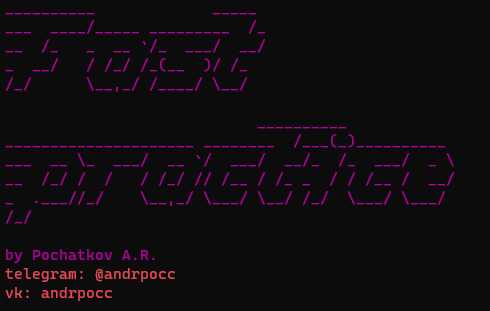
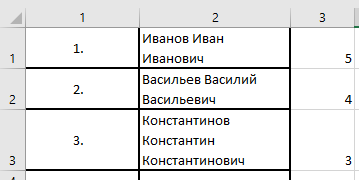

# FAST PRACTICE

Консольная программа для быстрого создания сопутствующей учебным практикам документации
в электронном виде.

Генерация PDF документов содержащих:

- Аттестационный лист
- Лист успеваемости
- Направление на практику
- Отчет по практике

Шаблоны для генерации PDF документов находятся в папке **\templates** в директории с установленной программой.

### Инструкция:
1. Скачайте и установите приложение на свой ПК. Ссылка на программу находится под подписью **Releases**.
2. Создайте таблицу в ПО Excel следующего формата:

    

4. Перенесите **.xlsx** файл в окно с программой и нажмите клавишу **Enter**.
5. PDF файлы будут сохранены в директорию, в которой находится **.xlsx** файл. 
6. **Остальное программа сделает за вас!**